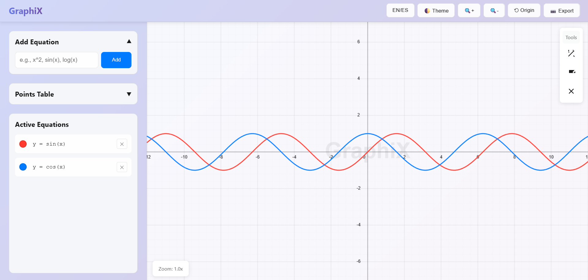
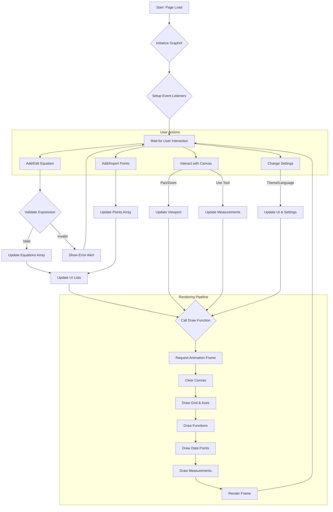

# 📈 GraphiX - 2D Mathematical Visualizer


---

## GraphiX v1.0

GraphiX is a powerful and interactive web-based 2D graphing calculator. Built with vanilla HTML, CSS, and JavaScript, it provides a modern, responsive, and intuitive interface for plotting functions, analyzing data points, and performing measurements. Its design is inspired by professional tools, featuring a "liquid glass" aesthetic with light and dark themes.


*Figure 1. Main application interface in light theme.*

---

## 💡 About The Project

This project was developed as a feature-rich alternative to traditional graphing calculators, focusing on a seamless user experience and a clean, modern design. It's built entirely with web technologies, making it accessible on any device with a browser, without the need for installation.

The application is modular, with its structure, styling, and logic separated into `index.html`, `style.css`, and `app.js` respectively, making it easy to maintain and extend.

---

## ✨ Features

GraphiX comes packed with a wide range of features for both educational and analytical purposes:

* **Dynamic Function Plotting**:
    * ➕ Add multiple equations with customizable colors.
    * ✏️ Edit equations directly from the active list.
    * 🔬 Robust math parser supports standard functions (`sin`, `cos`, `log`, `sqrt`, etc.) and operators (`+`, `-`, `*`, `/`, `^`).
    * ⚠️ Real-time error validation to prevent invalid or non-plottable expressions.

* **Interactive Canvas**:
    * 🖐️ Pan and zoom with intuitive mouse controls (drag to pan, scroll to zoom).
    * 📏 Dynamic grid with major and minor lines that adapt to the zoom level for better readability.
    * 💧 Watermark with the application's name.

* **Data Point Plotting**:
    * ✍️ Manually add `(x, y)` coordinates through an interactive table.
    * 📄 Import data points directly from a `.csv` file (format: two columns, `x,y`, no headers).
    * 📊 All points are rendered on the graph in real-time.


*Figure 2. The collapsible points table for manual data entry and CSV import.*

* **Measurement Tools**:
    * 🛠️ A floating toolbar on the canvas for easy access.
    * 📐 **Distance Tool**: Measure the Euclidean distance between any two points on the graph.
    * 📏 **Angle Tool**: Measure the angle formed by three selected points.
    * 🎯 Results are displayed directly on the graph for clear visualization.
    * 🗑️ Easily clear all measurements from the canvas.


*Figure 3. Distance and Angle measurement tools in action.*

* **Customization and Usability**:
    * 🎨 **Light & Dark Themes**: Switch between themes for comfortable viewing in any lighting condition.
    * 🌐 **Multilingual Support**: Instantly toggle the entire UI between English and Spanish. The language preference is saved locally.
    * 📱 **Responsive Design**: The interface adapts smoothly to any screen size, from mobile devices to large desktop monitors.
    * 🖼️ **Image Export**: Export the current view of the graph as a high-quality `.png` image.

---

## 🚀 Getting Started

To get a local copy up and running, follow these simple steps.

### Prerequisites

You only need a modern web browser (like Chrome, Firefox, or Edge).

### Installation

1.  Clone the repo:
    ```sh
    git clone https://github.com/jesusvasquezjr3/GraphiX
    ```
2.  Navigate to the project directory:
    ```sh
    cd GraphiX
    ```
3.  Open the `index.html` file in your web browser.

---

## 📖 Usage

* **Adding a Function**: Type a mathematical expression in the "Add Equation" input field and click "Add" or press `Enter`.
* **Editing a Function**: Click on the equation text in the "Active Equations" list to enter edit mode. Press `Enter` to save or `Escape` to cancel.
* **Changing a Function's Color**: Click on the color circle next to an equation to open a color picker.
* **Plotting Points**: Expand the "Points Table" section. Click "Add Point" to add a row manually or "Import CSV" to load a file.
* **Using Measurement Tools**: Click on a tool icon (Distance or Angle) in the top-right panel. Click on the canvas to place points. To deactivate a tool, click its icon again. Click the clear button to remove all measurements.
* **Changing Language**: Click the "EN/ES" button in the header to toggle between English and Spanish.

---

## 🏗️ Workflow Diagram

The following diagram illustrates the application's general workflow, from user interaction to canvas rendering.



-----

## 📁 File Structure

The project is organized into three main files for clarity and modularity:

  * **`index.html`**: The main HTML file that defines the structure of the application.
  * **`style.css`**: The stylesheet that contains all the visual rules, including colors, layout, and responsiveness.
  * **`app.js`**: The core JavaScript file that contains all the application logic, including the `GraphiX` and `MathParser` classes, event handling, and canvas drawing functions.

## 📜 License MIT
Copyright © 2025 Jesús Vásquez - Latest version of the project (v1.0) July 28, 2025
